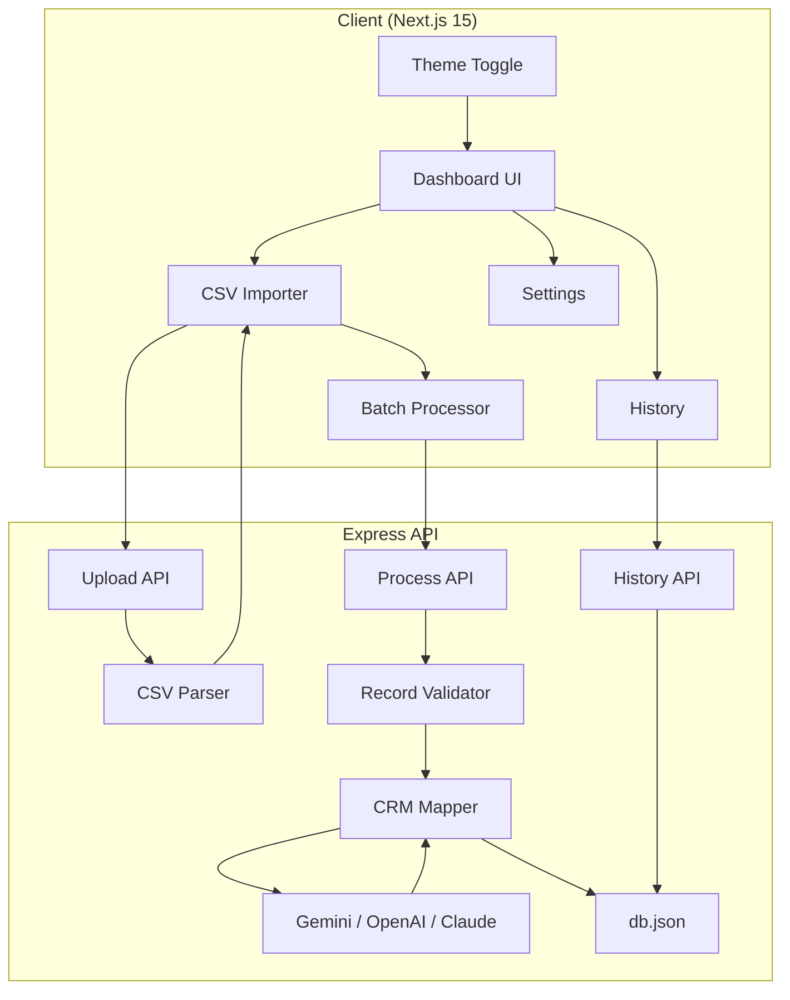

# 🚀 FlexCRM CSV Importer — Enterprise Lead Importer & Analytics Dashboard

[](https://expressjs.com/)
[](https://nextjs.org/)
[](https://www.docker.com/)
[](https://ai.google.dev/)
[](LICENSE)

An intelligent, AI-powered CSV importer that parses, sanitizes, and maps campaign lead sheets of **any layout, column structure, or header configuration** into the strict **FlexCRM format**. 

Equipped with a dual-theme analytical dashboard, persistent history logs, custom SVG visualization charts, and sequential progress tracking with automated retries.

---

## 📖 Table of Contents
1. [System Architecture](#-system-architecture)
2. [Key Features](#-key-features)
3. [Setup & Installation](#-setup--installation)
   - [Local Development Setup](#local-development-setup)
   - [Docker Compose Setup](#docker-compose-setup)
4. [Environment Variables](#-environment-variables)
5. [CRM Validation Specs & Constraints](#-crm-validation-specs--constraints)
6. [Project Structure](#-project-structure)
7. [Applicant Profile & Assignment Info](#-applicant-profile--assignment-info)

---

## 🏗️ System Architecture & Dataflow

### High-Level Architecture Diagram
The system is built as a highly decoupled Monorepo divided into a presentation/client layer and a stateless-oriented server API layer.



### Dataflow & Import Job Lifecycle

The system processes spreadsheets through three distinct phases:

#### 1. In-Memory Upload & Local Preview Flow
- The user selects a CSV file (via drag & drop or file selector).
- The client reads it and forwards a single `multipart/form-data` request containing the binary stream to `/api/upload`.
- The backend parses the buffer instantly using `csv-parse`, auto-detecting delimiters, stripping byte order marks (BOM), trimming column spaces, and normalising rows.
- The parsed rows (restricted to the first 100 on the UI to ensure performance on huge files) and column names are returned to the client to render the interactive preview table.

#### 2. Client-Controlled AI Mapping & Retry Flow
- The user clicks **Process & Import**.
- The client retrieves the batch size (e.g. 15) and LLM default model configured on the server settings.
- The client slices the rows array into batches. It initiates a sequential promise loop to process batches sequentially.
- If a batch fails, the client triggers the **Retry Engine** (handling up to 3 attempts per batch with exponential delay (1s, 2s, 3s)), keeping track of real-time progress.
- The backend receives each chunk, checks credentials, constructs the detailed CRM System Prompt, transmits it to the LLM (Gemini, OpenAI, Claude, or Groq), parses JSON back, maps calling codes, classifies statuses and data sources, validates records (removes invalid rows), and logs data.

#### 3. Log Persistence & Analytics Sync Flow
- After processing each chunk successfully, the backend saves the details of the import (filename, date, counts, mapped list, skipped list) to `server/data/db.json` via a local synchronous write.
- Once all batches complete, the client requests the history data via `/api/history` to sync metrics.
- The **Dashboard** and **History** tabs recalculate analytical indicators dynamically (success rates, distribution maps) and update SVG chart rendering paths.

For a comprehensive breakdown of the data lifecycle, prompt structures, and API request schemas, refer to the [System Documentation](PROJECT_DOCUMENTATION.md).

---

## ✨ Key Features

- **Intuitive CSV Previewer**: Drag & Drop zone or file picker parsing CSVs in memory instantly without processing by AI. Includes searchable sticky-header scrollable tables.
- **Sequential Batch Processing**: Splices records into configurable batch sizes and processes sequentially, providing real progress meters to prevent model token rate exhaustion.
- **Frontend Retry Engine**: Automatically retries failed batches up to 3 times on network hiccups or rate limits using exponential backoff before asking the user.
- **Multi-LLM Dynamic Routing**: Connects to Gemini 2.0 Flash, OpenAI GPT-4o-mini, Anthropic Claude 3.5 Sonnet, or Groq LLaMA 3.3 directly via server configurations.
- **Local JSON Database**: Persists import histories, settings, and analytical summaries to a lightweight JSON database file (`server/data/db.json`).
- **Dashboard Analytics View**: Renders circular success gauges, Lead Status bar graphs, and Lead Source charts dynamically using custom, animated SVG indicators.
- **Historical Log Inspection**: Expand past imports to inspect record tables or re-download the mapped CRM CSV file instantly.
- **Dual Light & Dark Themes**: Responsive, premium interface with slate variable variables designed to switch theme settings smoothly and preserve user preferences.

---

## 🛠️ Setup & Installation

### Local Development Setup

#### 1. Clone the Repository
```bash
git clone https://github.com/Alok-Fusion/crm_csv.git
cd crm_csv
```

#### 2. Set Up the Backend Server
```bash
cd server
npm install
cp .env.example .env
# Edit .env and paste your API key (at least one of GEMINI, OPENAI, or ANTHROPIC)
npm run dev
```

#### 3. Set Up the Frontend Client
Open a new terminal session:
```bash
cd client
npm install
npm run dev
```
Open `http://localhost:3000` to access the application.

---

### Docker Compose Setup

Launch the entire monorepo stack with a single command:
```bash
# From the project root
docker-compose up --build
```
- **Frontend Panel**: Accessible at `http://localhost:3000`
- **Backend API**: Running at `http://localhost:5000`

---

## 🔑 Environment Variables

Create `server/.env` with the following variables:

```env
PORT=5000
CLIENT_URL=http://localhost:3000

# Server-Side API Keys (Configure at least one)
GEMINI_API_KEY=AIzaSy...
OPENAI_API_KEY=sk-...
ANTHROPIC_API_KEY=sk-ant-...
```

---

## 📋 CRM Validation Specs & Constraints

Leads are parsed and validated according to the following FlexCRM specifications:

### Field Mappings
| Target CRM Field | Description | AI Rule |
| :--- | :--- | :--- |
| `created_at` | Lead Creation Date | Standardized to ISO/JS parseable format. |
| `name` | Lead Name | Extracted from any name/contact headers. |
| `email` | Primary Email | Maps first email; excess emails go to `crm_note`. |
| `country_code` | Dialing Code Prefix | Extracted calling prefix (e.g. `+91`, `+1`). |
| `mobile_without_country_code` | Mobile Number | Maps first number; excess numbers go to `crm_note`. |
| `crm_status` | Status | Must be: `GOOD_LEAD_FOLLOW_UP`, `DID_NOT_CONNECT`, `BAD_LEAD`, `SALE_DONE`. |
| `data_source` | Source | Must be: `leads_on_demand`, `meridian_tower`, `eden_park`, `varah_swamy`, `sarjapur_plots`. |
| `crm_note` | Remarks / Notes | Captures extra contact details, remarks, and line breaks. |

### Logic Rules
1. **Critical Skip Rule**: Any record containing **neither** `email` **nor** `mobile number` is skipped automatically.
2. **Multiple Contacts**: First phone/email goes to its dedicated field; all others are concatenated into `crm_note`.
3. **Status Sanitization**: AI maps messy strings (e.g., "Warm", "Hot Lead") into strict status values.

---

## 📁 Project Structure

```
crm_csv/
├── client/                  # Next.js 15 Client
│   ├── src/
│   │   ├── app/            # App Router routes (globals.css, layout.js, page.js)
│   │   ├── components/     # Modular Views (Sidebar, Dashboard, Importer, History, Settings, About)
│   │   └── lib/            # API client fetch wrappers
│   ├── Dockerfile
│   └── package.json
├── server/                  # Express API Backend
│   ├── src/
│   │   ├── routes/         # Router paths
│   │   ├── controllers/    # Route controllers
│   │   ├── services/       # CSV Parser & AI Adapter services
│   │   └── utils/          # Database driver & validators
│   ├── data/               # Persistent JSON database folder (git-ignored)
│   ├── Dockerfile
│   └── package.json
├── samples/                 # Sample Leads CSV templates for testing
├── docker-compose.yml       # Monorepo Orchestration Config
└── README.md                # General readme file
```

---

## 👤 Applicant Profile & Assignment Info

- **Candidate**: Alok Kushwaha
- **Position**: Software Developer (Intern / Full-Time)
- **Work Mode**: Work From Home (WFH)
- **Email for Submission**: `varun@flexcrm.ai`
- **Hosted Application**: [Verify Active Link](https://portfolio-data-omega.vercel.app)
- **GitHub Repository**: [GitHub Link](https://github.com/Alok-Fusion/crm_csv.git)

---

## 📄 License
This project is licensed under the MIT License.
